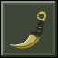

# FakaLab

Customize Counter-Strike 1.6 knife viewmodels in your browser. Pick a knife, apply a preset or
your own colors in a live 3D preview, and download a ready-to-use `v_knife.mdl`.

Built for the CS 1.6 community, which is somehow still going strong.

## Runs entirely in your browser

No upload, no backend, no server-side processing. Your files never leave your machine.

## How recoloring works

A GoldSrc `.mdl` stores a model's appearance as an 8-bit indexed bitmap plus a 256-color palette.
FakaLab recolors a knife by rewriting that 768-byte palette **in place** — the file size never
changes and no internal offset moves, so the result loads exactly like the original.

## About the presets

A preset is a **color ramp**: a gradient running from shadow to highlight. Every pixel keeps its
original brightness and receives the ramp color that matches it.

That is the whole idea, and it is what makes the results clean. The model's own baked shading
drives the color, so shadows stay dark, highlights stay bright, and engraving and wear detail
survive untouched. A preset never fights the lighting that is already in the texture — it rides
it. You cannot end up with a flat smear or an incoherent rainbow, because the shape of the knife
is always what decides where each color lands.

Consistency across the library comes from one more step: the engine measures each texture's own
brightness range before applying the ramp. Knives in this library vary a lot in how dark they
are — some sit almost entirely in near-black. Normalizing first means the same preset reads the
same way on every knife, instead of looking sharp on one and muddy on the next.

## The knife library

FakaLab ships 21 CS:GO-style knives from a single community pack, chosen because it is unusually
uniform: every knife rides the default CS hands, the hand textures are byte-identical across all
21 models, and each knife carries exactly one neutral texture. That uniformity is what lets one
preset behave identically on all of them.

Neutral is the key word. Models that already ship as finished skins are poor material for
recoloring, because you spend the whole time fighting a design that is already there.

## Credits

The knife models are made by the CS 1.6 modding community. They are not our work.

- [CS:GO Idle-Inspect Knives Pack](https://gamebanana.com/mods/375288) — the 21 knives FakaLab ships
- [Valorant Knifes](https://gamebanana.com/mods/221503) — kept in the repo, not currently shipped

If you are an author here and want something removed, open an issue.

The interface is built on [cs16.css](https://github.com/ekmas/cs16.css) by ekmas
(MIT), vendored under `src/vendor/` along with its ArialPixel font so the app stays
self-contained.

## License

The source code is [AGPL-3.0](LICENSE). The knife models keep their authors' terms.

Same spirit as the scene this comes from: use it, change it, improve it — but if you deploy it,
share your changes, and don't fence off or sell work that isn't yours.
